# API Gateway-Based Architectures (API Gateway + WAF + Lambda Authorizer)

## API Gateway Overview

AWS API Gateway provides managed REST, HTTP, and WebSocket APIs with:
- Throttling
- Caching
- Authorization (Lambda or JWT authorizers)
- Request/response transformation
- WAF protection (for REST APIs)

## Authorizers in API Gateway

In AWS API Gateway there are authorizers which act as security features used to control access to API endpoints. They function by verifying the authorization status of a request before it reaches the backend service.

### Authorizer Types
1. ❌ JWT Authorizer
- Supported only for HTTP APIs, not available for REST APIs
- Does NOT support EC algorithms (RSA only)
- Therefore, not suitable for Skyfire, since Skyfire uses ES256-based JWTs.

2. ✔ Lambda Authorizer
- Works for both REST and HTTP APIs
- You define full authentication logic inside your Lambda function
- Can integrate with Skyfire token verification
- Supports setting identity sources (header, query param, etc.)

Note: API Gateway supports one authorizer per route. If you need multiple layers of validation, you must implement them inside your Lambda Authorizer.

## ​​AWS WAF Overview
AWS WAF is a web application firewall that lets you inspect the inbound HTTP and HTTPS traffic that are forwarded to your protected web application resources using:
- IP rules
- String/regex matching
- Rate-limit rules
- Managed rule groups
- Bot Control (Bot Manager)
- CAPTCHA / Challenge actions

For each rule one can choose to:
- Allow
- Block
- Count
- Run CAPTCHA
- Run Challenge
AWS WAF lets you control access to your content. Based on conditions that you specify, such as the IP addresses that requests originate from or the values of query strings, your protected resource responds to requests either with the requested content, with an HTTP 403 status code (Forbidden), or with a custom response.

#### Bot Classification Requirement

The client needs to classify bots into 3 categories:

1. Allowed Bots (no Skyfire token required)
Examples:
- Googlebot
- Bingbot
These should bypass Skyfire logic if verified as good bots.

2. Bots with Skyfire Token
- Acceptable: These must present a valid Skyfire token. If a token is missing or invalid, then block.
- Non-acceptable: Even if a Skyfire token is present, these should not override other WAF security rules.

Examples:
- AI scrapers
- Automated crawlers

3. Unidentified bots (which don’t present Skyfire token)

##### Important Requirement

```
Bot classification should not prevent the Skyfire token verification rule from running.
Bot logic + Skyfire token logic must both be considered before allowing access.
```

This typically requires:
- Correct priority ordering of WAF rules
- Using WAF labels or rule groups
- Ensuring Skyfire-related logic happens after bot evaluation
- Ensuring Lambda Authorizer logic still fires for acceptable bot types

## API Gateway + WAF

REST APIs natively support AWS WAF integration. Some additional REST related WAF rules but apart from that same bot related configurations as used in CloudFront

For HTTP APIs, you typically need to front them with an Amazon CloudFront distribution and then associate the WAF Web ACL with the CloudFront distribution to achieve WAF protection.
`Cloudfront -> WAF -> API Gateway`
Note: This will incur additional cost for Cloudfront service

## Deployment Steps

1. Create a REST API Gateway 


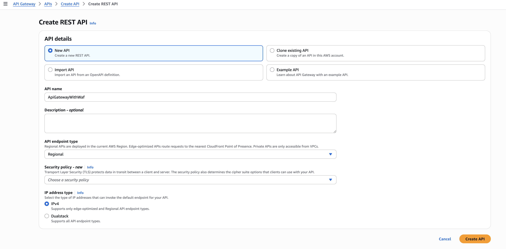

Create resources and methods based on your endpoint requirements

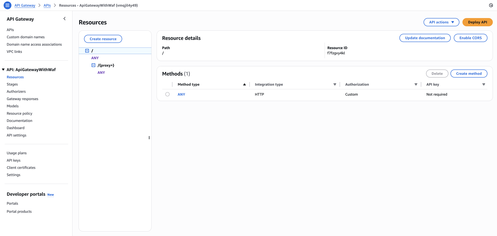

2. Create Lambda Authorizer

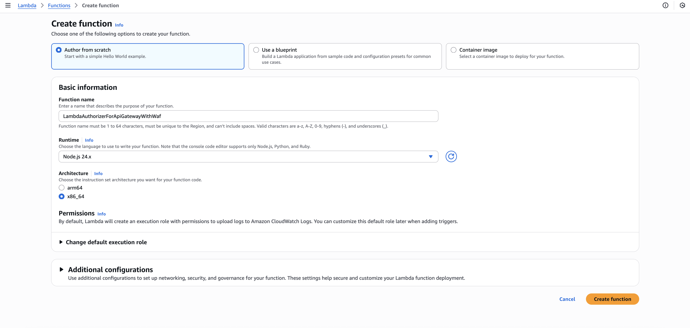

Sample Lambda Authorizer code for API Gateway cann be found [here](../api-gateway-waf/lambda-authorizer/)

3. Associate the Lambda Authorizer with the created API Gateway

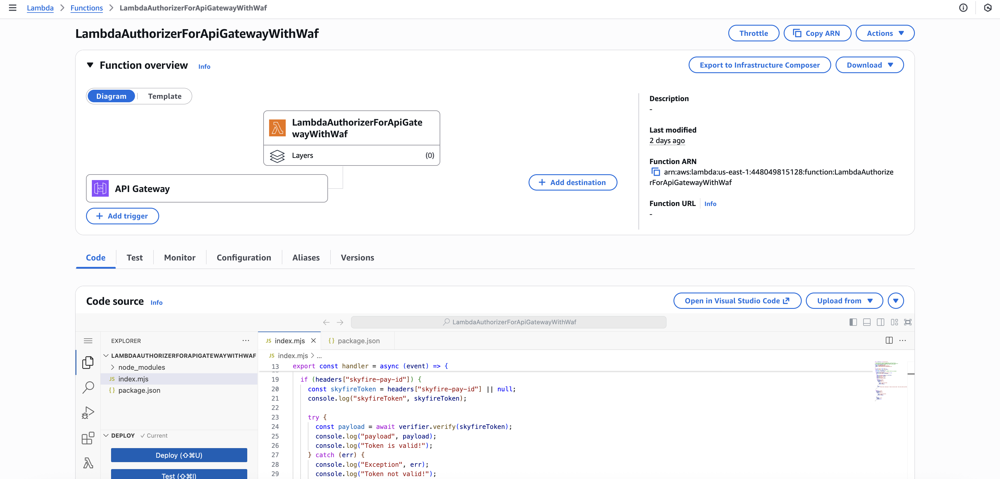

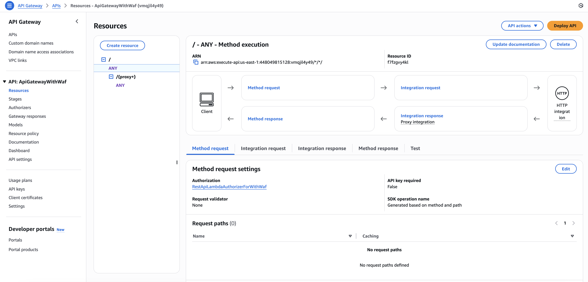

4. Configure Web ACL for API Gateway

In the AWS WAF console, create a new Web ACL/Protection Pack

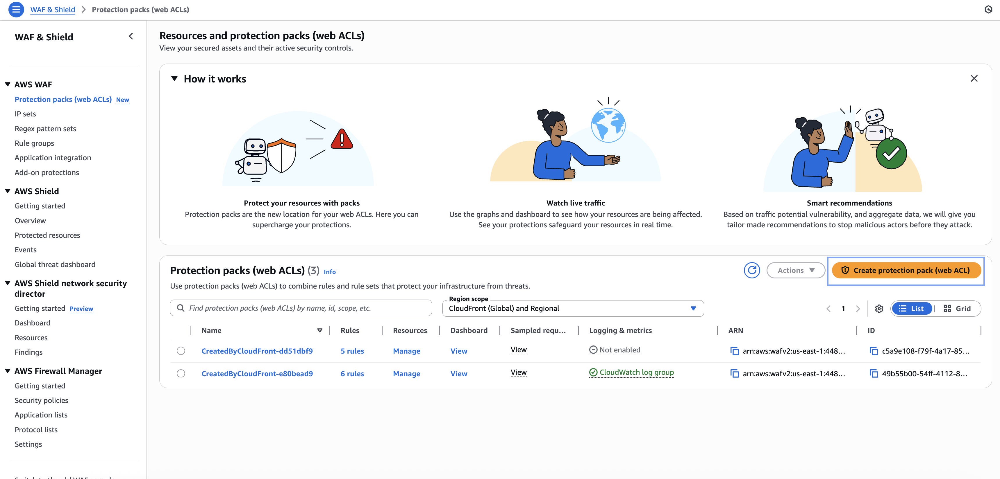

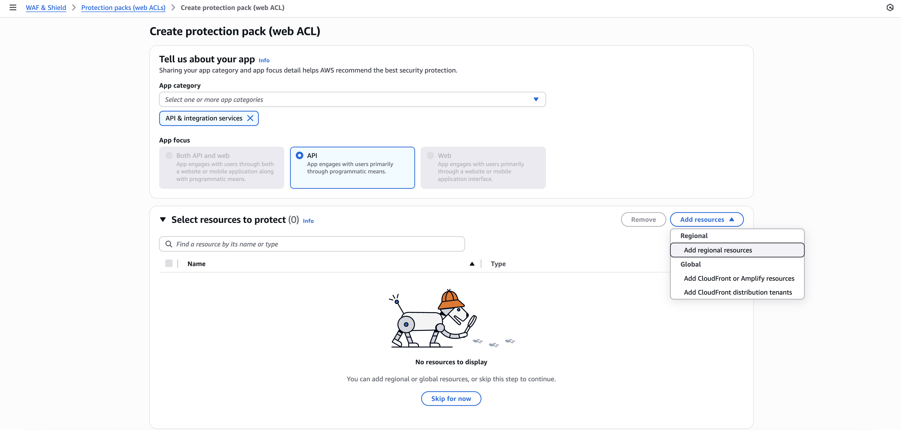

Select the correct API Gateway to which we want to link WAF from the Resources dropdown

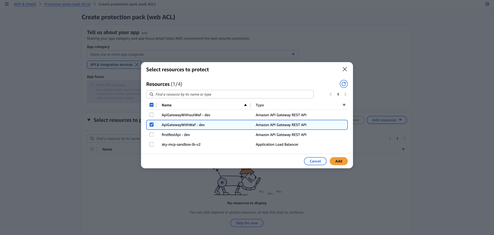

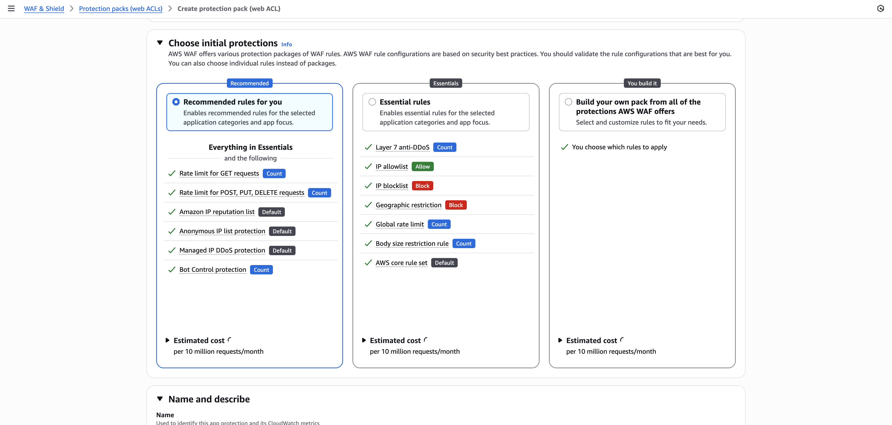

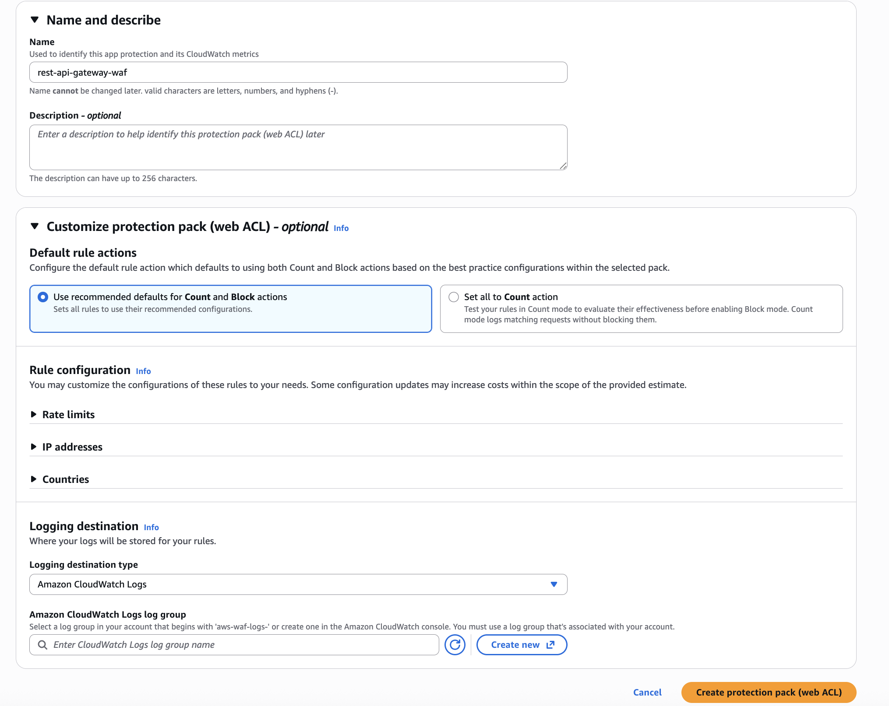

A Web ACL/Protection Pack is now created with some default rules -

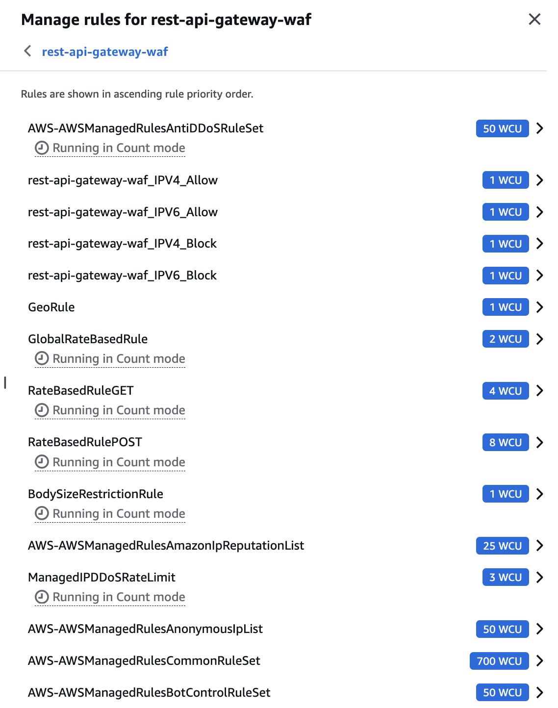

Let's establish WAF rules in order to accomplish the above discussed bot manager requirement - 

1. Allowed bots - 

**`AWSManagedRulesBotControlRuleSet`** categorises bot requests into various categories and adds corresponding category labels (which can be used to target particular category of bots in the following rules). 


We have the capability to choose one of allow, block, count, challenge for each of these category bots.

In this sample, we have directly allowed **`CategorySeo`** & **`CategorySearchEngine`** from this rule


2. Bots with Skyfire Token - 

    We can configure this rule using labels from `AWSManagedRulesBotControlRuleSet`. All monitored and permissible bot categories from previous rule for allowing access to certain bot categories with valid Skyfire KYA Token - [!Configured list](../static/images/cloudfront-waf/cloudfront-waf-bots-require-skyfire-token.png)

    In this sample, we've configured `awswaf:managed:aws:bot-control:bot:category:ai` and `awswaf:managed:aws:bot-control:bot:category:scraping_framework` to be allowed only when there is a valid Skyfire KYA token by adding a `SkyfireTokenRequired` label to all bot requests that match this rule condition.

    ```
    // JSON view

    {
    "Action": {
        "Count": {}
    },
    "Name": "BotsRequireSkyfireToken",
    "Priority": 7,
    "RuleLabels": [
        {
            "Name": "SkyfireTokenRequired"
        }
    ],
    "Statement": {
        "OrStatement": {
            "Statements": [
                {
                    "LabelMatchStatement": {
                        "Key": "awswaf:managed:aws:bot-control:bot:category:ai",
                        "Scope": "LABEL"
                    }
                },
                {
                    "LabelMatchStatement": {
                        "Key": "awswaf:managed:aws:bot-control:bot:category:scraping_framework",
                        "Scope": "LABEL"
                    }
                }
            ]
        }
    },
    "VisibilityConfig": {
        "CloudWatchMetricsEnabled": true,
        "MetricName": "BotsRequireSkyfireToken",
        "SampledRequestsEnabled": true
    }
}
    ```

In the last `SkyfireDecisioning` rule, we block the request, if a particular bot request has an associated `SkyfireTokenRequired` label but doesn't have a `skyfire-pay-id` JWT in the request header. 

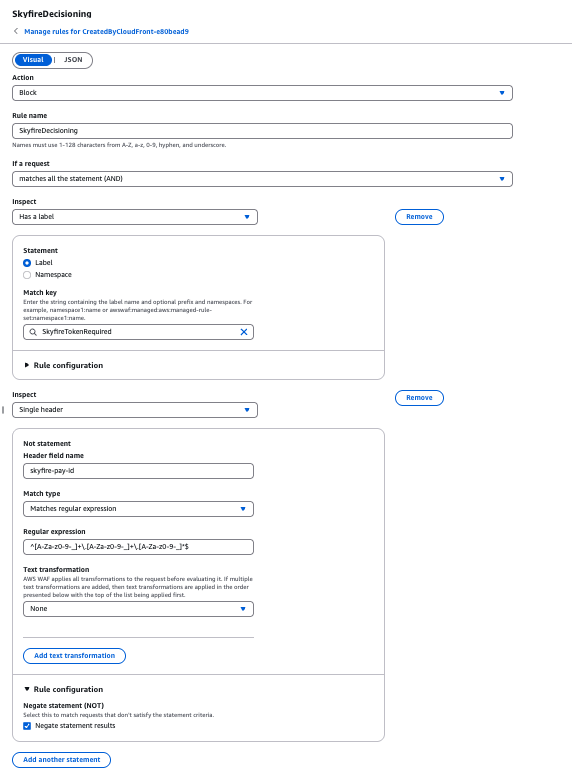

A custom response can be set when WAF blocks requests to origin server


```
JSON view

{
    "Action": {
        "Block": {
            "CustomResponse": {
                "CustomResponseBodyKey": "missing-KYA-token-error",
                "ResponseCode": 401
            }
        }
    },
    "Name": "SkyfireDecisioning",
    "Priority": 8,
    "Statement": {
        "AndStatement": {
            "Statements": [
                {
                    "LabelMatchStatement": {
                        "Key": "SkyfireTokenRequired",
                        "Scope": "LABEL"
                    }
                },
                {
                    "NotStatement": {
                        "Statement": {
                            "RegexMatchStatement": {
                                "FieldToMatch": {
                                    "SingleHeader": {
                                        "Name": "skyfire-pay-id"
                                    }
                                },
                                "RegexString": "^[A-Za-z0-9-_]+\\.[A-Za-z0-9-_]+\\.[A-Za-z0-9-_]*$",
                                "TextTransformations": [
                                    {
                                        "Priority": 0,
                                        "Type": "NONE"
                                    }
                                ]
                            }
                        }
                    }
                }
            ]
        }
    },
    "VisibilityConfig": {
        "CloudWatchMetricsEnabled": true,
        "MetricName": "SkyfireDecisioning",
        "SampledRequestsEnabled": true
    }
}
```

Note: WAF rules can be re-ordered to meet business logic requirements.
Note: Depending on the use-case, these rules are entirely configurable and extendable (including list for **`BotsRequireSkyfireToken`**) - any bot categories can be set up for allow or blocking directly by WAF bot manager itself, and any other for monitoring to apply custom rule later in the priority order. 
