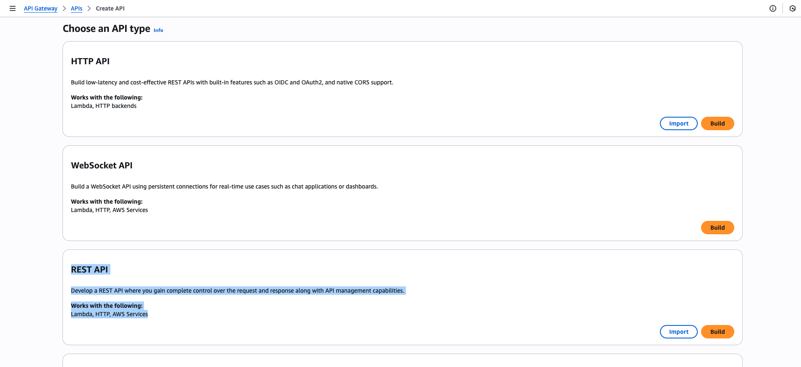
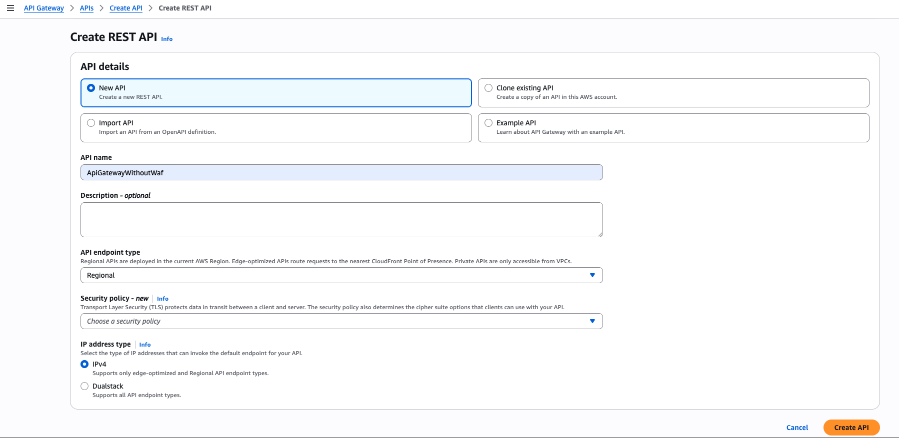
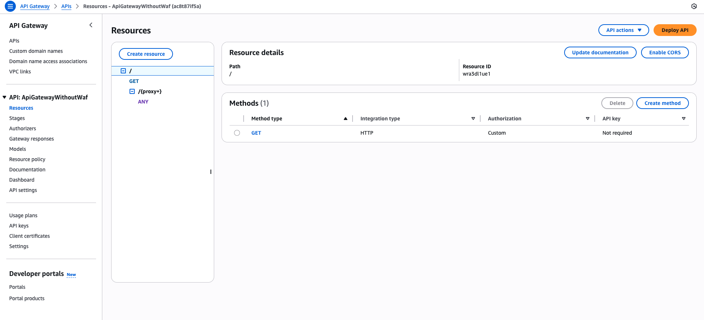
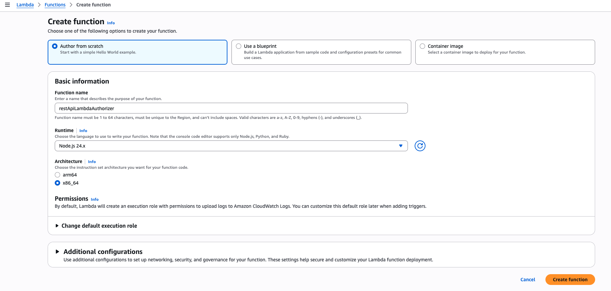
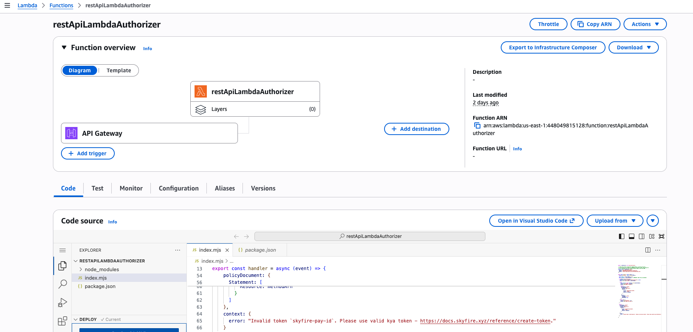
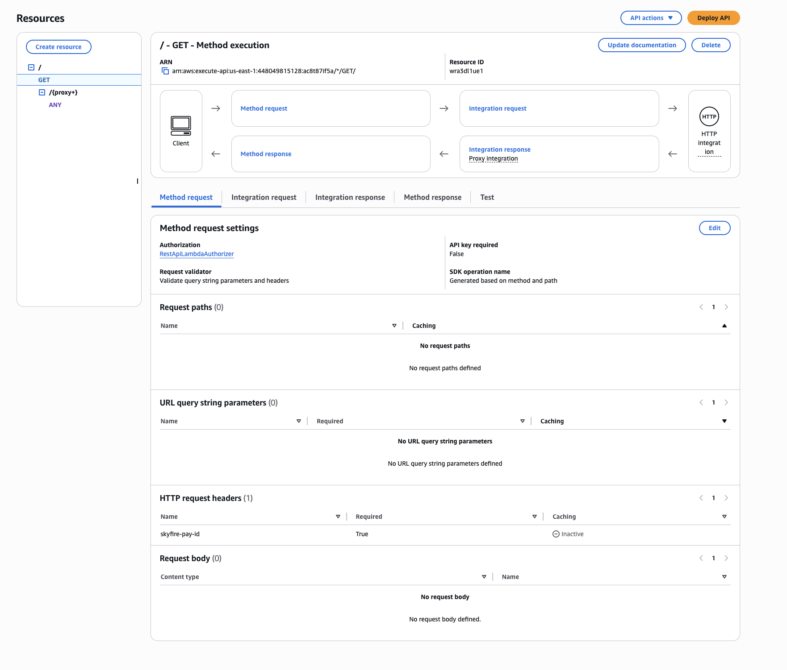

# API Gateway-Based Architectures (API Gateway + Lambda Authorizer)

## API Gateway Overview

AWS API Gateway provides managed REST, HTTP, and WebSocket APIs with:
- Throttling
- Caching
- Authorization (Lambda or JWT authorizers)
- Request/response transformation
- WAF protection (for REST APIs)

## Authorizers in API Gateway

In AWS API Gateway there are authorizers which act as security features used to control access to API endpoints. They function by verifying the authorization status of a request before it reaches the backend service.

### Authorizer Types
1. ❌ JWT Authorizer
- Supported only for HTTP APIs, not available for REST APIs
- Does NOT support EC algorithms (RSA only)
- Therefore, not suitable for Skyfire, since Skyfire uses ES256-based JWTs.

2. ✔ Lambda Authorizer
- Works for both REST and HTTP APIs
- You define full authentication logic inside your Lambda function
- Can integrate with Skyfire token verification
- Supports setting identity sources (header, query param, etc.)

Note: API Gateway supports one authorizer per route. If you need multiple layers of validation, you must implement them inside your Lambda Authorizer.

[!API Gateway Sequence Diagram](https://github.com/skyfire-xyz/skyfire-solutions-aws-news-crawler-demo/tree/SKYK-930-aws-integration/platforms/aws/cloudfront-waf)

## Deployment Steps

1. Create a REST API Gateway 

Create resources and methods based on your endpoint requirements

2. Create Lambda Authorizer

Sample Lambda Authorizer code for API Gateway cann be found [here](../api-gateway/lambda-authorizer/)

3. Associate the Lambda Authorizer with the created API Gateway

