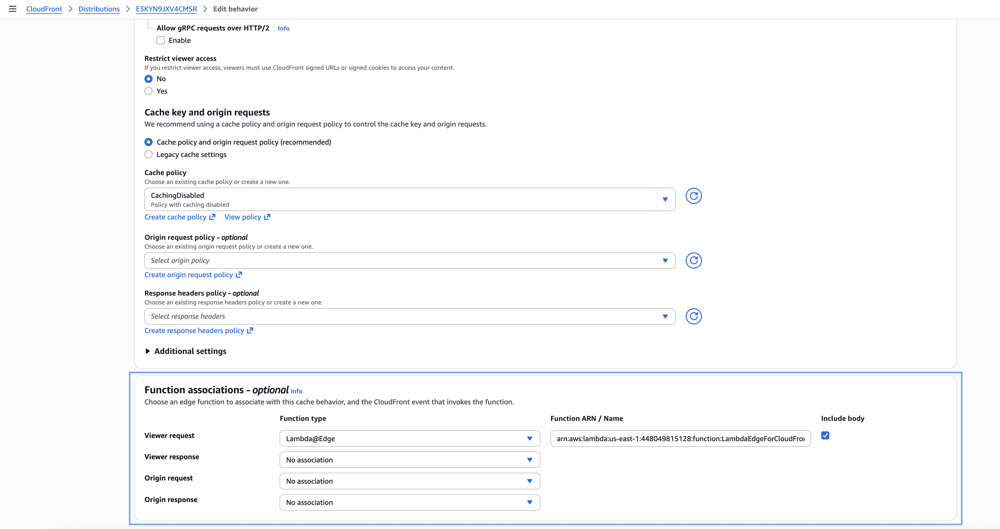
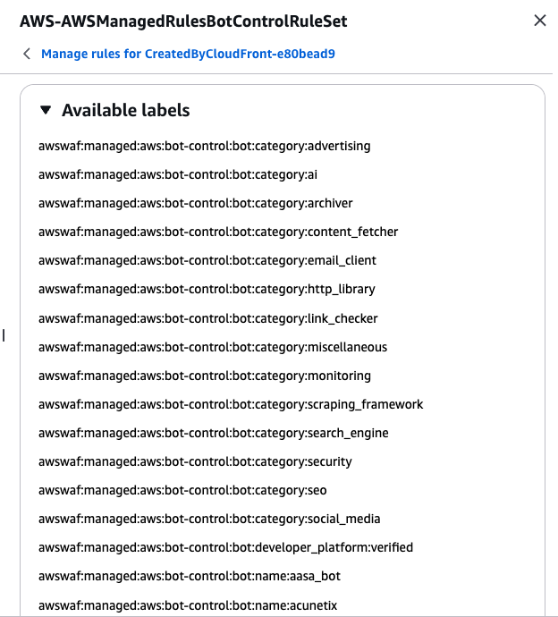
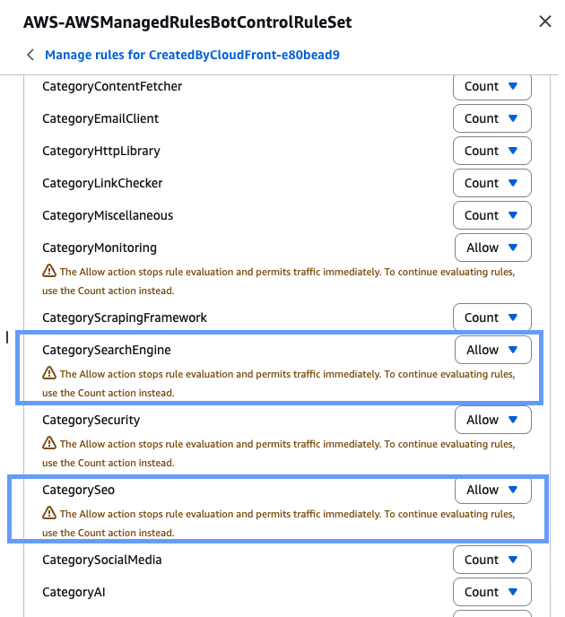
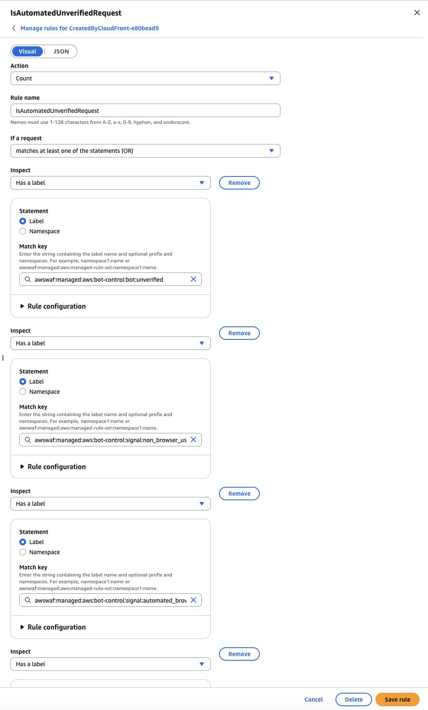
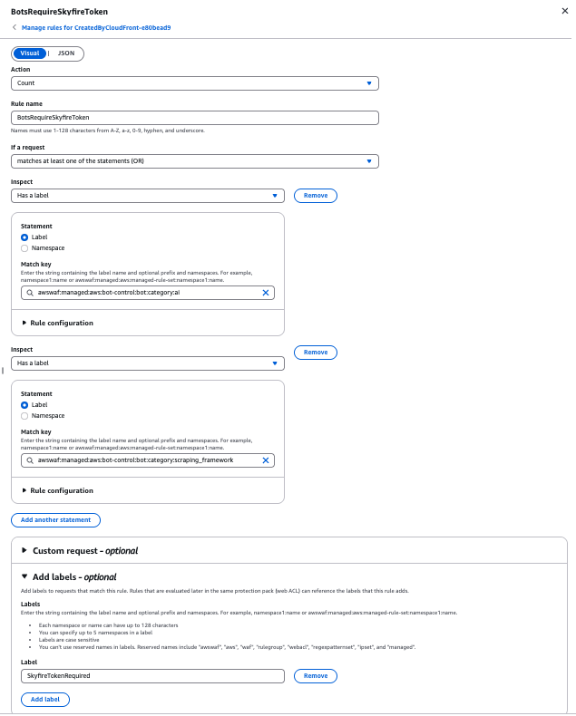
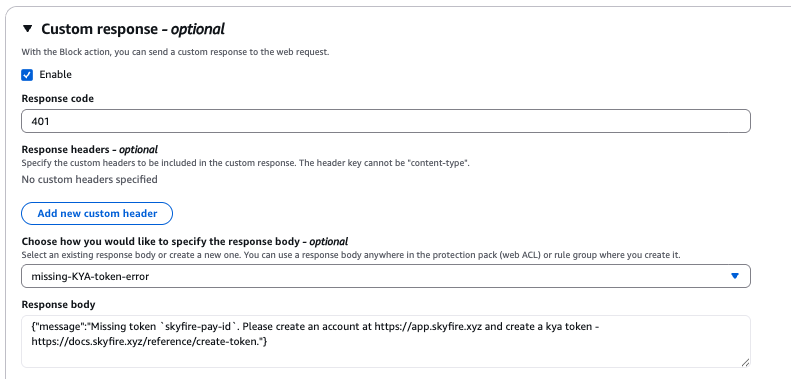
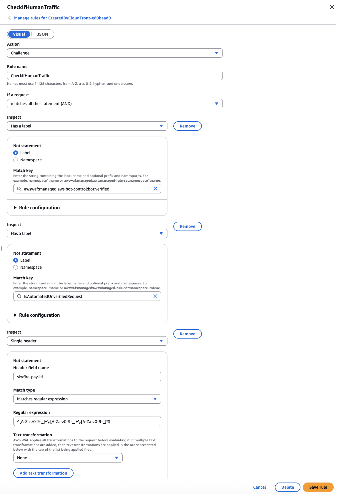

# CloudFront-Based Architectures (CloudFront + AWS WAF + Lambda@Edge)

## CloudFront Overview
Amazon CloudFront is AWS’s global content delivery network (CDN). It accelerates delivery of web assets (static and dynamic content, APIs, media) by caching content at globally distributed edge locations. Requests are served from the nearest edge location, reducing latency and improving performance.
CloudFront integrates seamlessly with multiple AWS services and can be extended using edge compute (Lambda@Edge).

## CloudFront + Lambda@Edge

You can attach Lambda@Edge functions to CloudFront to run custom logic at the edge before requests reach your origin. Lambda@Edge enables token validation, request transformation, bot checks, security filtering, and more - all close to your users.
CloudFront Events Supported by Lambda@Edge
Lambda@Edge functions can be invoked during four event phases:
- Viewer Request: Triggered when CloudFront receives a request from a viewer before checking the cache.
- Origin Request: Triggered when CloudFront forwards a request to the origin (executes only on cache misses).
- Origin Response: Triggered after CloudFront receives a response from the origin, but before caching it.
- Viewer Response: Triggered before CloudFront returns the response to the viewer (cache hit or miss).

A CloudFront distribution can attach one Lambda function per event type.

[Sample Lambda@Edge Function](../cloudfront-waf/lambda@edge/index.mjs) for Skyfire Token Verification

Note: This sample uses a Viewer Request event, so the token validation happens before cache evaluation.

If your environment requires advanced security (bot mitigation, IP filtering, rate limiting, geo-restrictions), you can layer AWS WAF on top of your CloudFront + Lambda@Edge architecture.

## ​​AWS WAF Overview
AWS WAF is a web application firewall that lets you inspect the inbound HTTP and HTTPS traffic that are forwarded to your protected web application resources using:
- IP rules
- String/regex matching
- Rate-limit rules
- Managed rule groups
- Bot Control (Bot Manager)
- CAPTCHA / Challenge actions

For each rule one can choose to:
- Allow
- Block
- Count
- Run CAPTCHA
- Run Challenge
AWS WAF lets you control access to your content. Based on conditions that you specify, such as the IP addresses that requests originate from or the values of query strings, your protected resource responds to requests either with the requested content, with an HTTP 403 status code (Forbidden), or with a custom response.

Note: When using AWS WAF, WAF evaluates the request before your Viewer Request Lambda@Edge executes.

#### Bot Classification Requirement

The client needs to classify bots into 3 categories:

1. Requests categorized as a “recognised bot” such as SEO (Googlebot), AI scrapers (GPTBot), Archiver bots etc -> decide and configure what to do (individually Allow/Block as per use-case)

2. Requests from "unrecognised bot" -> 
    - Skyfire KYA token is mandatory for access
    - If Skyfire token is missing or invalid, then block

3. Requests not recognised as bots (human traffic) -> Allow access to protected website without token

##### Important Requirement

```
Bot identification logic + Skyfire token logic must both be considered before allowing access.
```

This typically requires:
- Correct priority ordering of WAF rules
- Using WAF labels or rule groups
- Ensuring Skyfire-related logic happens after bot evaluation
- Ensuring Lambda@Edge logic validates the token if present

#### Deployment Steps
1. Create a CloudFront Distribution -

Configure your origin, cache policy, and any required behaviors based on your application architecture.


2. Create a Lambda@Edge Function - 

Lambda@Edge functions must be created in the N. Virginia (us-east-1) region. 
CloudFront's control plane is hosted exclusively in this region, and all edge function replication begins from here. More details [here](https://docs.aws.amazon.com/AmazonCloudFront/latest/DeveloperGuide/lambda-edge-how-it-works-tutorial.html).


Set the Lambda@Edge function trigger from Cloudfront




3. Configure Web ACL security on CloudFront Distribution

Let's establish WAF rules in order to accomplish the above discussed requirement - 


1. Requests categorized as a "recognised bot" - 

**`AWSManagedRulesBotControlRuleSet`** categorises bot requests into various categories and adds corresponding category labels (which can be used to target particular category of bots in the following rules). 



We have the capability to choose one of allow, block, count, challenge for each of these category bots.

In this sample, we have directly allowed **`CategorySeo`** & **`CategorySearchEngine`** from this rule


2. Requests from "unrecognised bot" - 

    We can configure this rule using labels from `AWSManagedRulesBotControlRuleSet`. All unverified and automated requests categories of bot from previous rule are labeled as `IsAutomatedUnverifiedResponse`. 
    

    ```
    //JSON view

{
    "Action": {
        "Count": {}
    },
    "Name": "IsAutomatedUnverifiedRequest",
    "Priority": 9,
    "RuleLabels": [
        {
            "Name": "IsAutomatedUnverifiedRequest"
        }
    ],
    "Statement": {
        "OrStatement": {
            "Statements": [
                {
                    "LabelMatchStatement": {
                        "Key": "awswaf:managed:aws:bot-control:bot:unverified",
                        "Scope": "LABEL"
                    }
                },
                {
                    "LabelMatchStatement": {
                        "Key": "awswaf:managed:aws:bot-control:signal:non_browser_user_agent",
                        "Scope": "LABEL"
                    }
                },
                {
                    "LabelMatchStatement": {
                        "Key": "awswaf:managed:aws:bot-control:signal:automated_browser",
                        "Scope": "LABEL"
                    }
                },
                {
                    "LabelMatchStatement": {
                        "Key": "awswaf:managed:aws:bot-control:targeted:signal:automated_browser",
                        "Scope": "LABEL"
                    }
                },
                {
                    "LabelMatchStatement": {
                        "Key": "awswaf:managed:aws:bot-control:targeted:signal:browser_automation_extension",
                        "Scope": "LABEL"
                    }
                }
            ]
        }
    },
    "VisibilityConfig": {
        "CloudWatchMetricsEnabled": true,
        "MetricName": "BotsRequireSkyfireToken",
        "SampledRequestsEnabled": true
    }
}
```
    
    For blocking access to these unverified bots without valid Skyfire KYA Token - 

    ```
    // JSON view
    {
    "Action": {
        "Block": {
            "CustomResponse": {
                "CustomResponseBodyKey": "missing-skyfire-KYA-error",
                "ResponseCode": 401
            }
        }
    },
    "Name": "BlockIfAutomatedRequestWithNoSkyfireToken",
    "Priority": 10,
    "Statement": {
        "AndStatement": {
            "Statements": [
                {
                    "LabelMatchStatement": {
                        "Key": "IsAutomatedUnverifiedRequest",
                        "Scope": "LABEL"
                    }
                },
                {
                    "NotStatement": {
                        "Statement": {
                            "RegexMatchStatement": {
                                "FieldToMatch": {
                                    "SingleHeader": {
                                        "Name": "skyfire-pay-id"
                                    }
                                },
                                "RegexString": "^[A-Za-z0-9-_]+\\.[A-Za-z0-9-_]+\\.[A-Za-z0-9-_]*$",
                                "TextTransformations": [
                                    {
                                        "Priority": 0,
                                        "Type": "NONE"
                                    }
                                ]
                            }
                        }
                    }
                }
            ]
        }
    },
    "VisibilityConfig": {
        "CloudWatchMetricsEnabled": true,
        "MetricName": "ChallengeIfUnverifieBotWithNoSkyfireToken",
        "SampledRequestsEnabled": true
    }
}
```

A custom response can be set when WAF blocks requests to origin server


3. Requests not recognised as bots (human traffic)

In the last `CheckIfHumanTraffic` rule, we Challenge the request. If a particular request isn't a verified or unverified bot and also doesn't have a `skyfire-pay-id` header, a challenge is posted and for all browsers the request is passed through to the prtected website and challenge remains pending for all automated requestes with no access to protected website.



```
JSON view

{
    "Action": {
        "Challenge": {}
    },
    "Name": "CheckIfHumanTraffic",
    "Priority": 12,
    "Statement": {
        "AndStatement": {
            "Statements": [
                {
                    "NotStatement": {
                        "Statement": {
                            "LabelMatchStatement": {
                                "Key": "awswaf:managed:aws:bot-control:bot:verified",
                                "Scope": "LABEL"
                            }
                        }
                    }
                },
                {
                    "NotStatement": {
                        "Statement": {
                            "LabelMatchStatement": {
                                "Key": "IsAutomatedUnverifiedRequest",
                                "Scope": "LABEL"
                            }
                        }
                    }
                },
                {
                    "NotStatement": {
                        "Statement": {
                            "RegexMatchStatement": {
                                "FieldToMatch": {
                                    "SingleHeader": {
                                        "Name": "skyfire-pay-id"
                                    }
                                },
                                "RegexString": "^[A-Za-z0-9-_]+\\.[A-Za-z0-9-_]+\\.[A-Za-z0-9-_]*$",
                                "TextTransformations": [
                                    {
                                        "Priority": 0,
                                        "Type": "NONE"
                                    }
                                ]
                            }
                        }
                    }
                }
            ]
        }
    },
    "VisibilityConfig": {
        "CloudWatchMetricsEnabled": true,
        "MetricName": "CheckIfHumanTraffic",
        "SampledRequestsEnabled": true
    }
}
```

Note: WAF rules can be reordered to meet business logic requirements.
Note: Depending on the use-case, these rules are entirely configurable and extendable - any bot categories can be set up for allow or blocking directly by WAF bot manager itself. 
